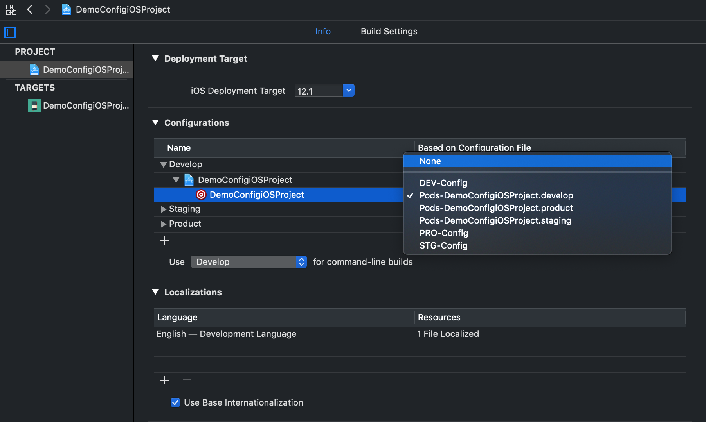
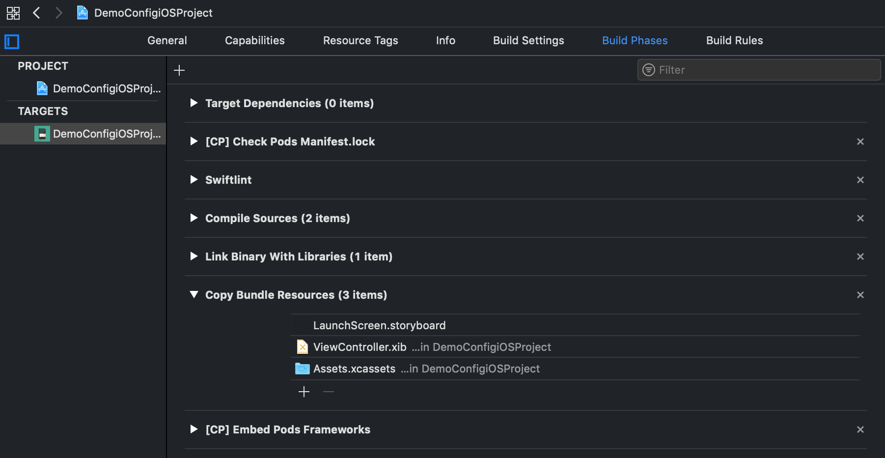
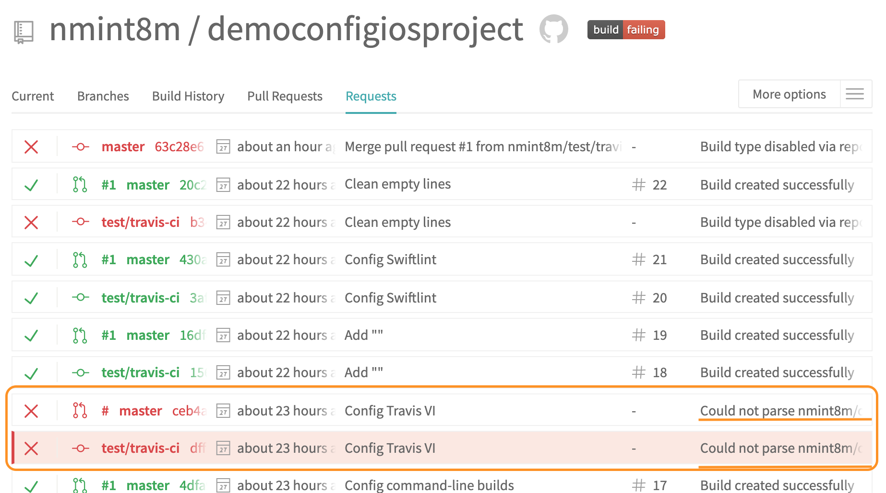
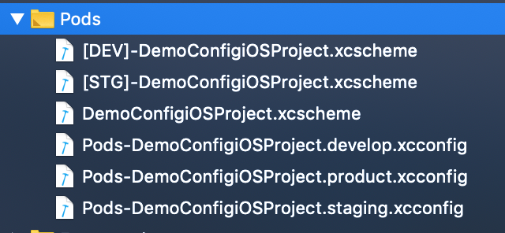
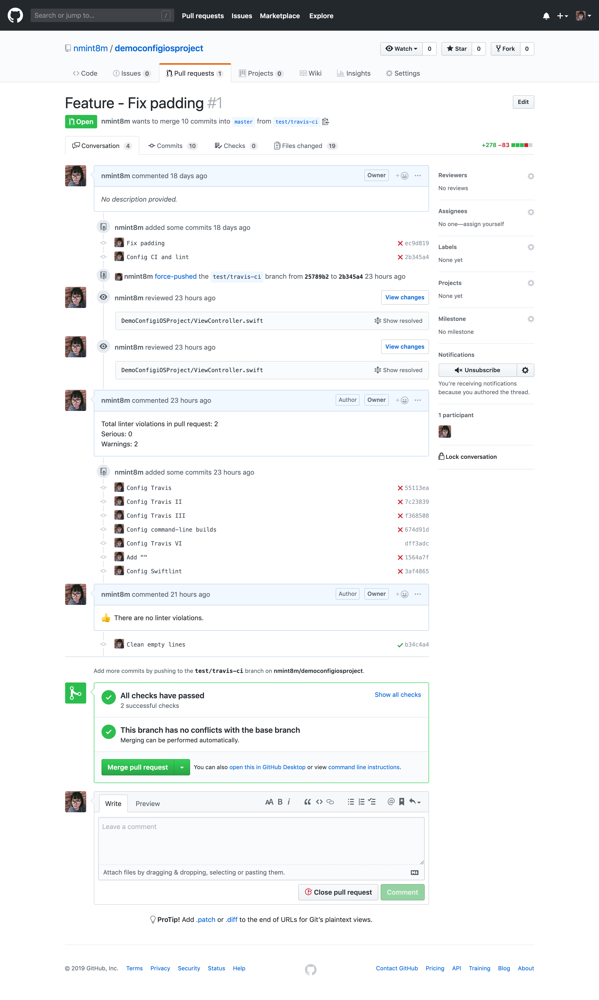

# democonfigiosproject
Configuring environment for an iOS project step by step. Fighting! 🌟

## Config Travis CI

A couple of problems I have met when configuring this project with Travis CI:

### The error `unable to open file in target` for *.xcconfig files

- Set the configuration file setting* `None` for the Pods related target.
- Close the `*.xcworkspace`.
- Run `pod install` again.
- Now open and build your `.xcworkspace` and add the Pods related target again.

<center>
	
</center>

### The error `Copy Bundle Resources build phase contains this target's Info.plist file`

- Remove `Info.plist` file in `Copy Bundle Resources` in `Build phase`.

<center>
	
</center>

### The error `could not parse` makes Travis CI not run

Error `could not parse` configuration in `.travis.yml` file. Just because of this character: `[]`.

<center>
	
</center>

To resolve this error, please remember to add double quotation masks `""` with `xcode_scheme` name:

```
xcode_scheme: "[DEV]-DemoConfigiOSProject"
```

instead of:

```
xcode_scheme: [DEV]-DemoConfigiOSProject
```

and:

```
- xcodebuild clean build -sdk iphonesimulator -workspace DemoConfigiOSProject.xcworkspace -scheme "[DEV]-DemoConfigiOSProject" CODE_SIGNING_REQUIRED=NO
```

instead of:

```
- xcodebuild clean build -sdk iphonesimulator -workspace DemoConfigiOSProject.xcworkspace -scheme [DEV]-DemoConfigiOSProject CODE_SIGNING_REQUIRED=NO
```

### The error `The workspace named "DemoConfigiOSProject" does not contain a scheme named "Develop"`

The problem is:

```
xcodebuild: error: The workspace named "DemoConfigiOSProject" does not contain a scheme named "[DEV]-DemoConfigiOSProject". The "-list" option can be used to find the names of the schemes in the workspace.
The command "xcodebuild clean build -sdk iphonesimulator -workspace DemoConfigiOSProject.xcworkspace -scheme "[DEV]-DemoConfigiOSProject" CODE_SIGNING_REQUIRED=NO" exited with 65.
```

To resolve this, make sure that you import file `*.xcscheme` into the project:

<center>
	
</center>

### Done configure Travis CI

<center>
	
</center>

## Config fastlane

A couple of problems I have met when configuring this project with fastlane:

[WIP]